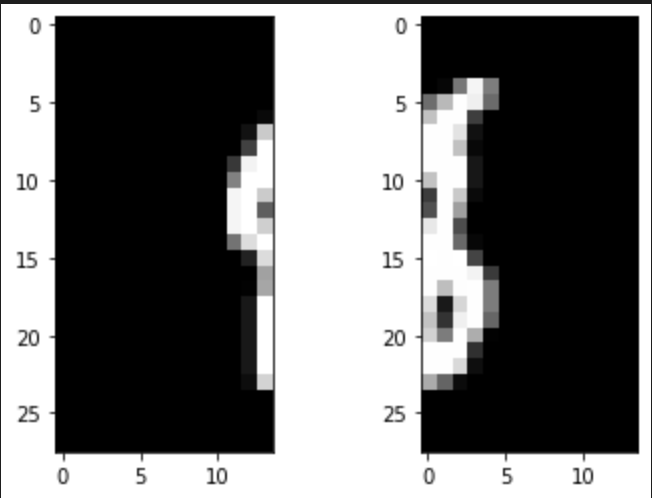

# Mnist reconstruction challenge


Imagine the digits in the test set of the MNIST dataset (http://yann.lecun.com/exdb/mnist/) got cut in half vertically and shuffled
around. Implement a way to restore the original test set from the two halves, whilst maximising the overall matching accuracy.

<p align="center">
    
p>

## Proposed solution

My solution is described step by step in the notebook *main.ipynb*.

It is based on a multi stage pipeline:

Solution 1: 

1. We can easily split the images into left and right halves because the mnist numbers are centered, so we always have non-zero pixels in the middle of the image (meaning the left half will have more pixels at the top than right for example)
2. Normally as we have a continuity between the left half and the right half, I think that comparing the top right vector of the left images with the top left vector of the right images will make it possible to effectively make pairs
3. Doing one by one comparison allows to generate an affinity matrix
4. We can create pairs using the affinity matrix (using hungarian method)

Solution 2:

1. Instead of using an heuristic for affinity matrix generation we propose to use a siamese network trained to associate left halves to the correct right half

Solution 3:

Ensembling solution 1 and 2 together

## Installation 

The code doesn't contain any fancy requirements.
It runs without any installation on google colab

You can install raw requirements using the following command:

```console
pip install -r requirements.txt
```

## Score

Current best score is a matching accuracy of **35.89% of images**.
It seems low but the task is quite complex as we have a limited set of images and a lot of images are extremely similar

## How to improve

If I had more time in order to improve the performances, I would
* use pytorch lightening / ray tune to properly set hyperparameters and select the network architecture
* Logging, tensorboard ...
* better select negative examples (we should give hard examples to the network)
* Better use mnist training labels that could help improving the siamese network generability
* The code is using the assumption that splitting will provide the same number of left halves and right halves. It should be modified for better generalization and error handling